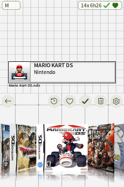
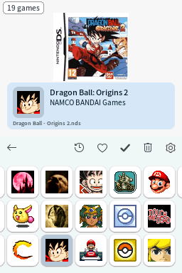
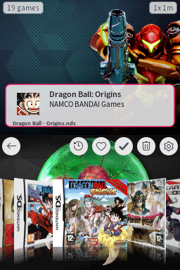
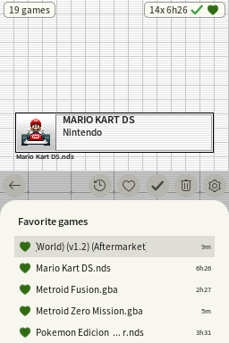
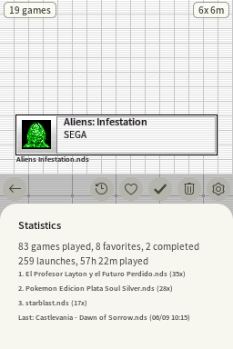

# Pico Launcher Enhanced

[](../../releases/latest)
[](../../releases)
[](LICENSE.txt)

A feature fork of [Pico Launcher](https://github.com/LNH-team/pico-launcher) by the LNH team, adding library features inspired by modern consoles — favorites, play stats, recently played, and more — while staying fully compatible with stock SD cards: it is a drop-in `_picoboot.nds` replacement, and all upstream features remain intact.







*Taken on the console with the launcher's own screenshot key (hold START).*

## Features

Everything upstream Pico Launcher offers (display modes, [custom icons, banners & covers](docs/Customization.md) for games *and folders*, [themes](docs/Themes.md), [cheats](docs/Cheats.md), [file associations](docs/FileAssociations.md) — see [Usage](docs/Usage.md)), plus:

- **Jump by initial** — press L or R to jump to the next initial letter in a folder sorted by name; a chip shows the letter you landed on
- **Game count** of the current folder on the top screen
- **Random game launch** with SELECT + A
- **Favorites** — press X on a game; a heart shows on the top screen
- **Completed games** — hold X on a game; a green check shows on the top screen
- **Favorites and completed filters** — heart and check buttons in the app bar, tinted while active
- **Favorites panel** — hold the heart button to see every favorite across all folders; tapping one jumps to it
- **Recently played panel** — clock button in the app bar; tapping an entry jumps to the game
- **Statistics panel** — hold the clock button for totals and most-played games
- **Screenshots** — hold START for about half a second to save both screens to `/_pico/screenshots`
- **Per-game launch tracking** — launch count and last-played date on the top screen
- **Approximate play time** — per game and in the statistics panel
- **Game deletion** — trash button with confirmation; removes the ROM and its save
- **Brightness control** — set the DS Lite's backlight level from display settings
- **Hide empty folders** — optional; folders with nothing playable inside are left out of the listing
- **Cheats list that reads better** — the list wraps around at both ends, and X turns every cheat off at once
- **Top strip readable on any theme** — the game count and launch info sit on their own backdrop, and a [custom theme](docs/Themes.md) can move or hide them
- **Per-folder background music** — drop a `bgm.bcstm` inside a folder
- **Time-of-day theme backgrounds** — optional night variants shown from 20:00 to 6:59
- **Per-file game data** — favorites, completed marks and play stats belong to the ROM file, so two copies of a game never share them

See [Enhanced features](docs/Enhanced.md) for details on each feature.

## Installation

1. Download `LAUNCHER.nds` from the [Releases](../../releases) page.
2. Rename it to `_picoboot.nds` and place it in the root of your SD card, replacing the existing one.

No other changes to your SD card are needed — themes, covers and the `_pico` folder from a stock setup keep working as-is.

> [!NOTE]
> To use Pico Launcher, the Pico Loader files (`aplist.bin`, `savelist.bin`, `picoLoader7.bin` and `picoLoader9.bin`) must also be present in the `/_pico` folder on your SD card.

## Setup & Configuration
We recommend using WSL (Windows Subsystem for Linux), or MSYS2 to compile this repository.
The steps provided will assume you already have one of those environments set up.

1. Install [BlocksDS](https://blocksds.skylyrac.net/docs/setup/)
2. Fetch the submodules: `git submodule update --init`

## Compiling

1. Run `make`

Alternatively, build with Docker (the same image used by CI) without installing BlocksDS locally:

```sh
docker run --rm -v "$PWD":/work -w /work skylyrac/blocksds:slim-v1.16.0 make
```

The launcher can be found in the root directory under the name `LAUNCHER.nds`.

2. Copy `LAUNCHER.nds` to your SD card.
    - If you are using DSpico, rename to `_picoboot.nds` and place it in the root of your SD card.
3. Copy the `_pico` pico folder to the root of your SD card.

For DSpico the final directory structure will look like this:
```
.
├── _pico
│   ├── themes
│   │   ├── material
│   │   │   └── theme.json
│   │   └── raspberry
│   │       ├── bannerListCell.bin
│   │       ├── bannerListCellPltt.bin
│   │       ├── bannerListCellSelected.bin
│   │       ├── bannerListCellSelectedPltt.bin
│   │       ├── bottombg.bin
│   │       ├── gridcell.bin
│   │       ├── gridcellPltt.bin
│   │       ├── gridcellSelected.bin
│   │       ├── gridcellSelectedPltt.bin
│   │       ├── scrim.bin
│   │       ├── scrimPltt.bin
│   │       ├── theme.json
│   │       └── topbg.bin
│   ├── aplist.bin
│   ├── savelist.bin
│   ├── picoLoader7.bin
│   └── picoLoader9.bin
└── _picoboot.nds
```
Note: If you want to play DSiWare on the DSpico, additional files are required. See the [Pico Loader](https://github.com/LNH-team/pico-loader) readme for more information.

## Extra tools

The [`tools/`](tools/) directory contains desktop helper scripts for preparing SD card content — cover art converters and fetchers, banner and icon generators, and night background makers. See [Tools](docs/Tools.md).

## Data formats

The fork stores per-game data (favorites, launch counts, play time) in `/_pico/gamedata.json`. Each entry belongs to one ROM file — if a favorite or a play count is not where you expect it, [Data storage](docs/Enhanced.md#data-storage) explains why in a table. The file format itself is documented in [Game data](docs/GameData.md) for tool authors.

## Contributing

Bug reports, ideas and pull requests are welcome — see [CONTRIBUTING.md](CONTRIBUTING.md).

## License

Icons by [icons8](https://icons8.com/)

This project is licensed under the Zlib license. For details, see `LICENSE.txt`.

Additional licenses may apply to the project. For details, see the `license` directory.

## Contributors
- [@Gericom](https://github.com/Gericom)
- [@XLuma](https://github.com/XLuma)
- [@Dartz150](https://github.com/Dartz150)
- [@lifehackerhansol](https://github.com/lifehackerhansol)

All credit for the launcher's foundation goes to the LNH team — this fork only builds on their excellent work.
